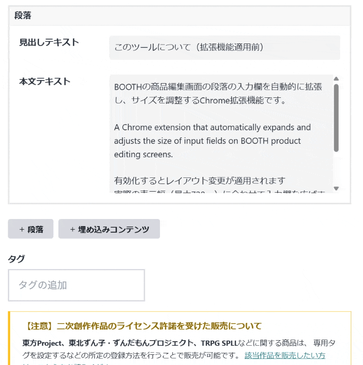
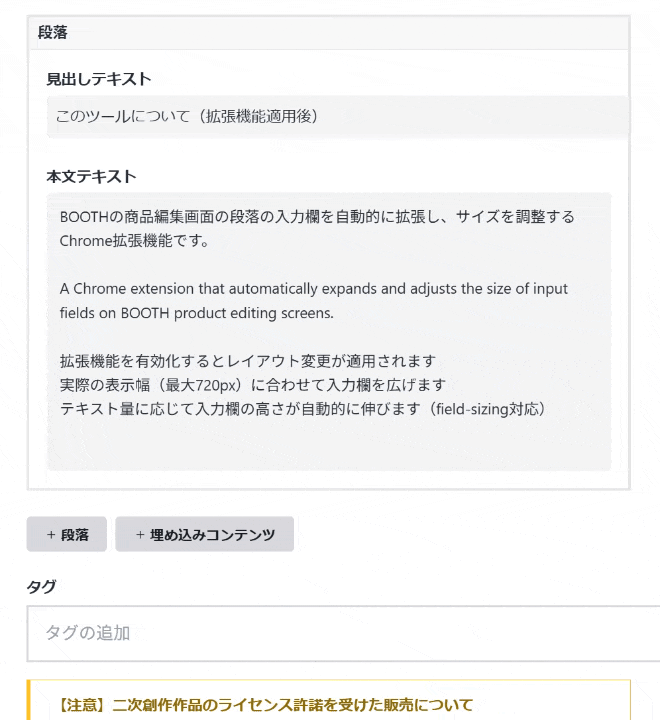

# Product Edit Page Extension for BOOTH

BOOTHの商品編集画面の段落の入力欄を自動的に拡張し、サイズを調整するChrome拡張機能です。

A Chrome extension that automatically expands and adjusts the size of input fields on BOOTH product editing screens.


<h3>📸 動作イメージ / Demo</h3>
<table>
  <tr>
    <th width="50%">Before (適用前)</th>
    <th width="50%">After (適用後)</th>
  </tr>
  <tr>
    <td></td>
    <td></td>
  </tr>
</table>

## 🎯 主な機能 / Features

### 日本語
- 有効化するとレイアウト変更が適用されます
- 実際の表示幅（最大720px）に合わせて入力欄を広げます
- テキスト量に応じて入力欄の高さが自動的に伸びます（field-sizing対応）

### English
- Layout changes are applied when activated
- Expands input fields to match the actual display width (max 720px)
- Input field height automatically extends according to text amount (field-sizing support)

## 📦 インストール方法 / Installation

### 日本語
1. **Chrome拡張機能ページを開く**
   - Chromeで `chrome://extensions/` にアクセス
   - または、メニュー → その他のツール → 拡張機能

2. **開発者モードを有効化**
   - 右上の「開発者モード」をONにする

3. **拡張機能を読み込む**
   - 「パッケージ化されていない拡張機能を読み込む」をクリック
   - ダウンロードしたフォルダを選択

### English
1. **Open Chrome Extensions Page**
   - Access `chrome://extensions/` in Chrome
   - Or, Menu → More Tools → Extensions

2. **Enable Developer Mode**
   - Turn ON "Developer mode" in the top right

3. **Load Extension**
   - Click "Load unpacked"
   - Select the downloaded folder

## 🚀 使い方 / Usage

### 日本語
1. 拡張機能をインストールして有効化する
2. BOOTHの商品編集画面（`https://manage.booth.pm/items/*/edit`）を開く
3. 自動的に入力欄が広がります。

### English
1. Install and enable the extension
2. Open BOOTH product editing screen (`https://manage.booth.pm/items/*/edit`)
3. Input fields automatically expand for comfortable editing

## ⚙️ 技術仕様 / Technical Specifications

### 対応ブラウザ / Supported Browsers
- Google Chrome (Manifest V3対応)
- Microsoft Edge (Chromium版)
- その他Chromiumベースのブラウザ / Other Chromium-based browsers

### ファイル構成 / File Structure
```
Product-Edit-Page-Extension-for-BOOTH/
├── manifest.json       # 拡張機能のマニフェストファイル / Extension manifest file
├── content.js          # 自動調整ロジック（設定値はここに記載）/ Auto-adjustment logic (settings defined here)
├── styles.css          # スタイルシート / Stylesheet
├── icon16.png          # アイコン（16x16）/ Icon (16x16)
├── icon48.png          # アイコン（48x48）/ Icon (48x48)
└── icon128.png         # アイコン（128x128）/ Icon (128x128)
```

## 🔧 カスタマイズ / Customization

動作設定（幅や高さ）を変更したい場合は、`content.js` 内の定数を直接編集してください。

To change operation settings (width and height), directly edit the constants in `content.js`.

```javascript
// content.js
const SETTINGS = {
  width: 100,       // 幅の割合 (%) / Width percentage (%)
  minHeight: 200,   // 最小高さ (px) / Minimum height (px)
  maxWidth: '720px' // 最大幅 (px) / Maximum width (px)
};
```

## 📝 注意事項 / Notes

### 日本語
- この拡張機能はBOOTHの公式ツールではありません
- BOOTHのUI更新により動作しなくなる可能性があります

### English
- This extension is not an official BOOTH tool
- It may stop working due to BOOTH UI updates

## 🙏 謝辞 / Acknowledgments

BOOTHの素晴らしいプラットフォームを提供してくださっているpixiv Inc.に感謝します。
Thank pixiv Inc. for providing the wonderful BOOTH platform.

また、本ツールの開発にあたり、以下のコードを参考にさせていただきました。素晴らしい知見を公開してくださった nekobako 様に感謝いたします。
Also, special thanks to nekobako for the inspiring code.
- [nekobako/content.js (Gist)](https://gist.github.com/nekobako/81cc427b7c80fe072ca82907b9da026f)

## 📄 ライセンス / License

MIT License


## 免責事項

- 非公式ツールであること 本拡張機能は、個人の開発者によって作成された非公式のソフトウェアです。pixiv Inc. および BOOTH 公式とは一切関係ありません。本拡張機能に関するお問い合わせを BOOTH 事務局へ送ることはお控えください。

- 保証の否認 本拡張機能は「現状有姿（as is）」で提供されます。開発者は、本拡張機能の動作、特定の目的への適合性、および不具合がないことを保証しません。また、BOOTH の仕様変更により、予告なく本拡張機能が動作しなくなる可能性があります。

- 責任の制限 本拡張機能の使用によって生じた、いかなる直接的・間接的な損害（商品説明文の消失、レイアウト崩れ、機会損失、アカウントへの影響などを含むがこれに限らない）について、開発者は一切の責任を負いません。ご利用は利用者ご自身の責任において行ってください。

- 権利の帰属 「BOOTH」は、ピクシブ株式会社の商標または登録商標です。

- BOOTHの仕様変更・改善について 本ツールは、BOOTH公式によるサイト改善や仕様変更を妨げるものではありません。BOOTH側のアップデートにより本ツールの機能が正常に動作しなくなった場合、BOOTH公式へのお問い合わせは絶対に行わないでください。本ツールの動作修正は、開発者の対応可能な範囲で行われます。


## 🔄 更新履歴 / Changelog

※ 今後の更新内容はこちらに記載されます / Future updates will be listed here
